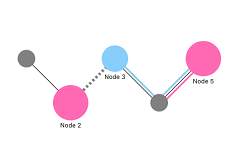

# Examples

See below for live examples of various uses.

[Basic usage](./basic)

[Layout / Positioning](./layout)

[Operations on Graphs](./operation)

[Appearance Customization](./appearance)

Make custom layer

